# Godot4.3微信小游戏导出工具 

这是一个将Godot4.3 将WEB适配为微信小游戏的小工具，自行编译了Godot4.3的WASM，将ScriptProcessor的音频废案代码重新添加回来，使得在微信小游戏当中能够播放声音,并且受控于Godot的音频总线。

裁剪或关闭了以下模块：
- 高级GUI： 
- 高级文本服务
- 关闭了webrtc
- 关闭了webxr
- 关闭了Openxr
- 关闭了javascript_eval: 本来小游戏就不让eval
- 3D为可选项

## 支持系统
- Windows 11 因为用了webview2的依赖
- Macos (等待开发)

## 教程

### Godot设置
1. 打开Godot启用Web导出
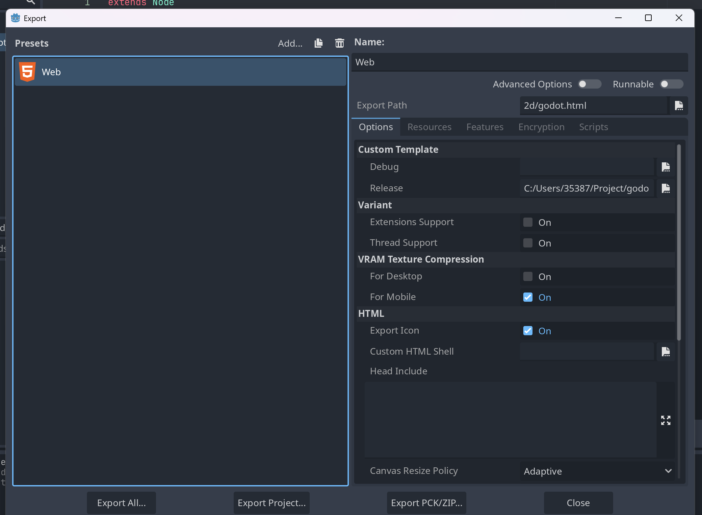
将For Mobile打开，如果有提示让你重新Import，请重新Import
2. 点开Resource栏,在exclude中将你不需要的文件夹都排除掉
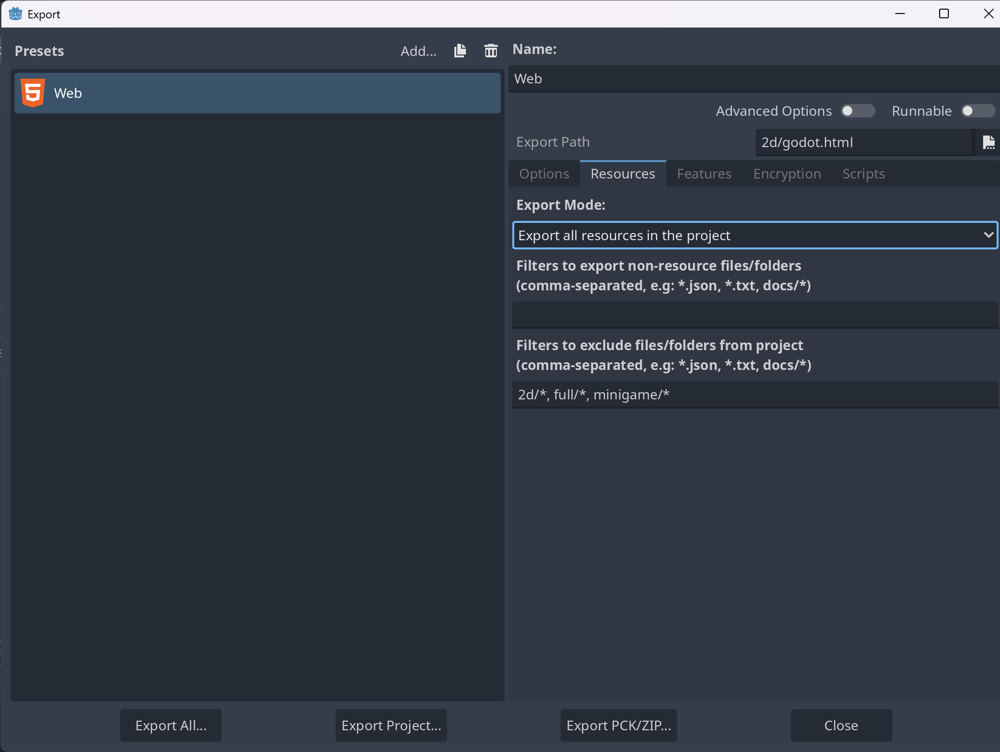

### 打开导出小工具
1. 设置Godot引擎路径
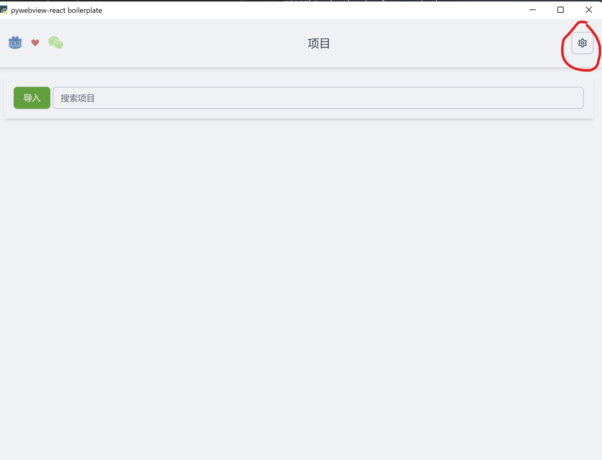
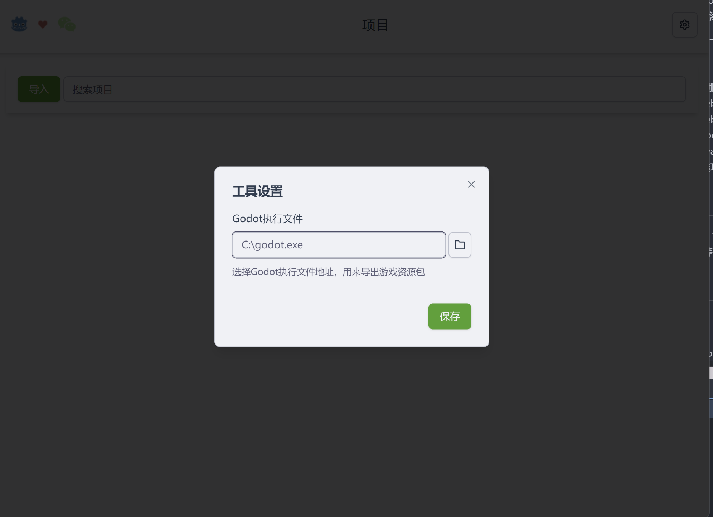
2. 导入项目
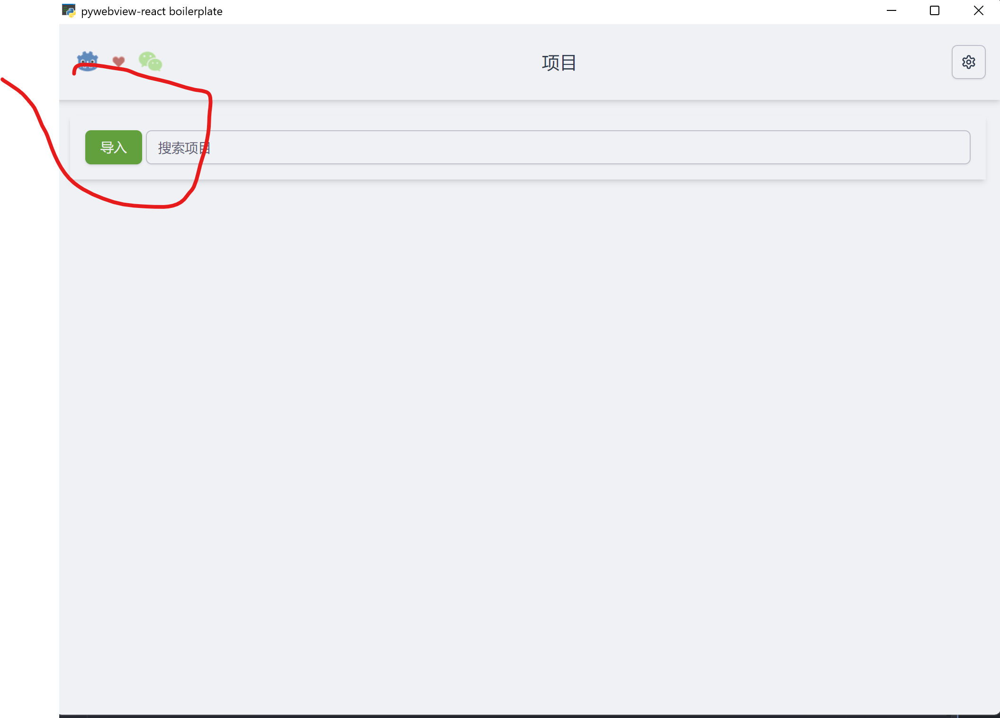
3. 点击项目卡片的设置按钮,并填写相关设置
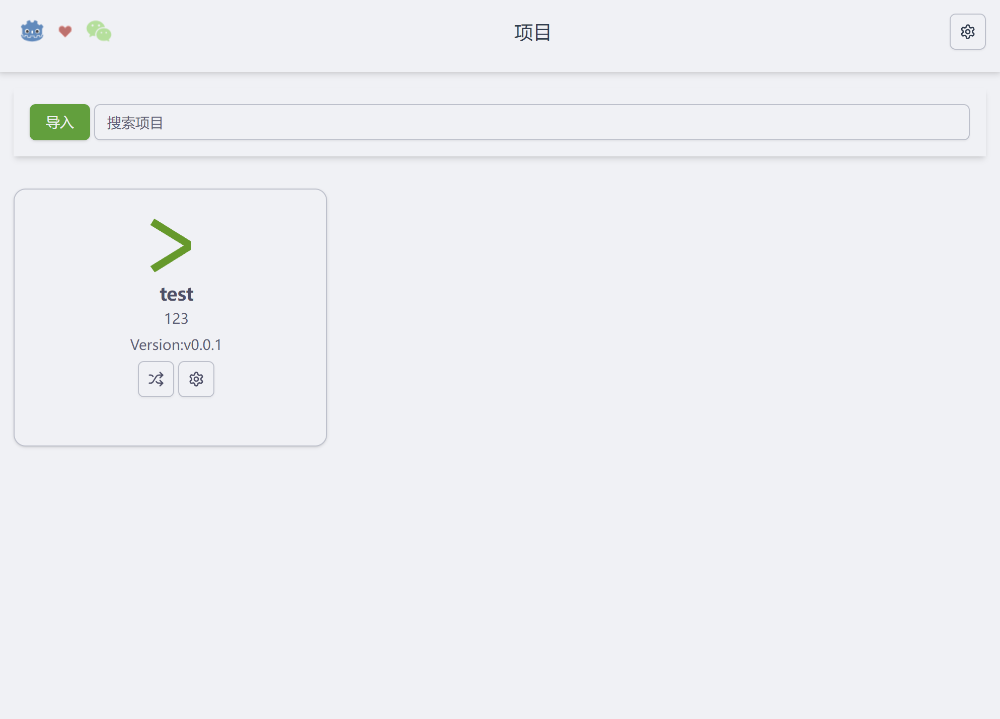
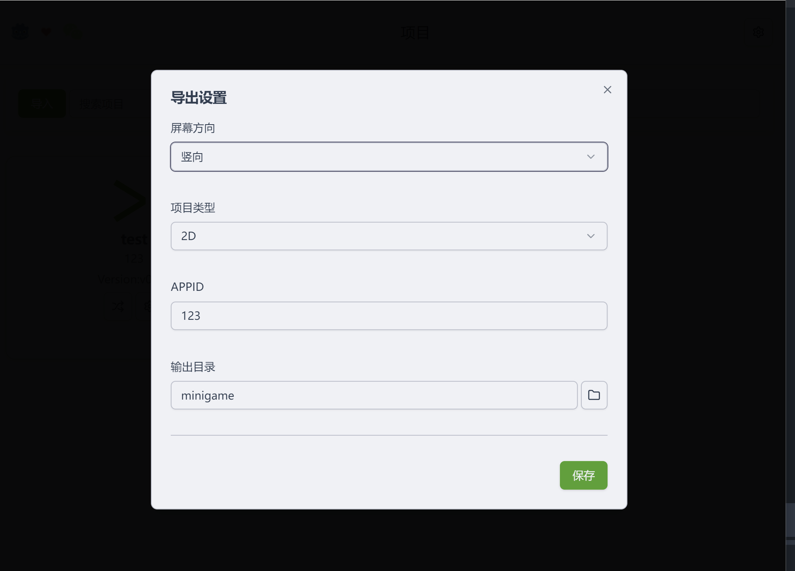
4. 点击导出并用开发者工具打开预览
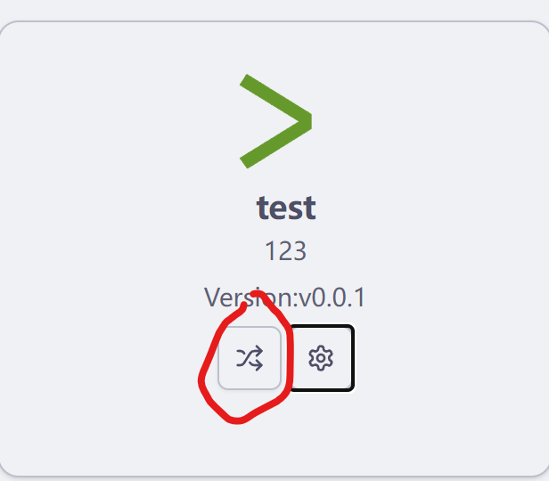

### 微信开发者工具设置
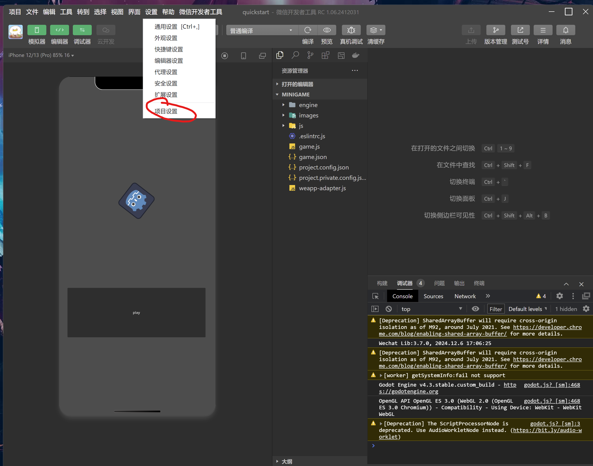
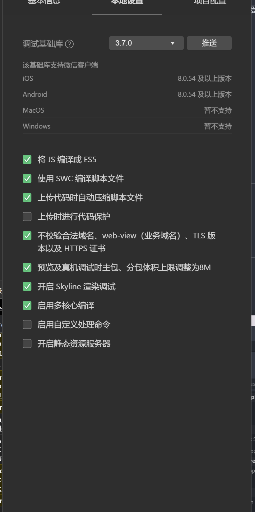

打开GPU加速
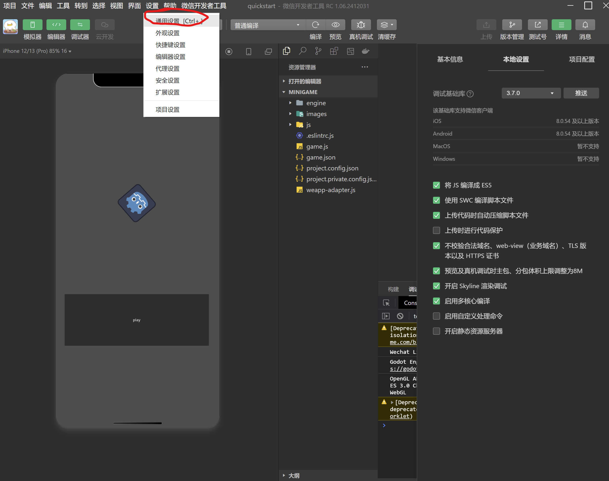
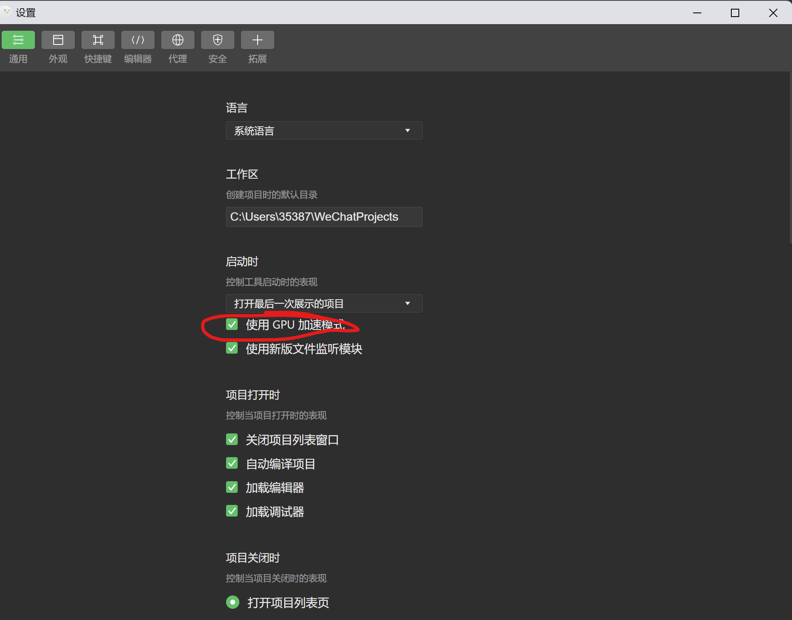

旧版本可能还要打开wasm参考Unity的设置
https://developer.unity.cn/projects/660b867dedbc2a2cce4cbf71