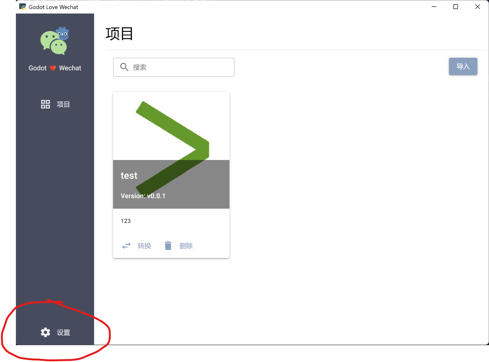
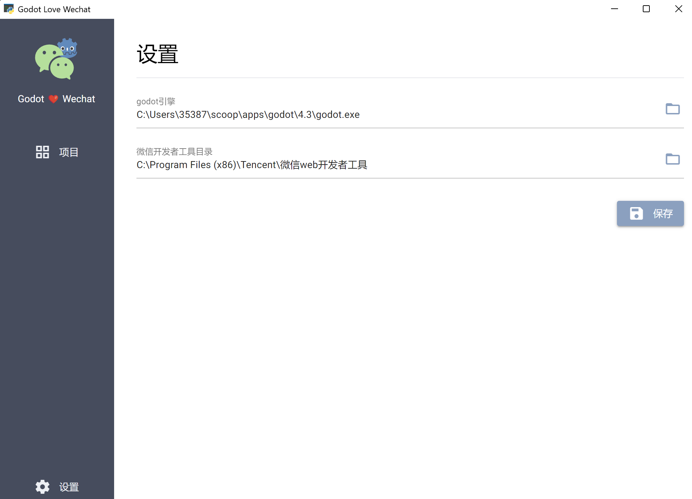
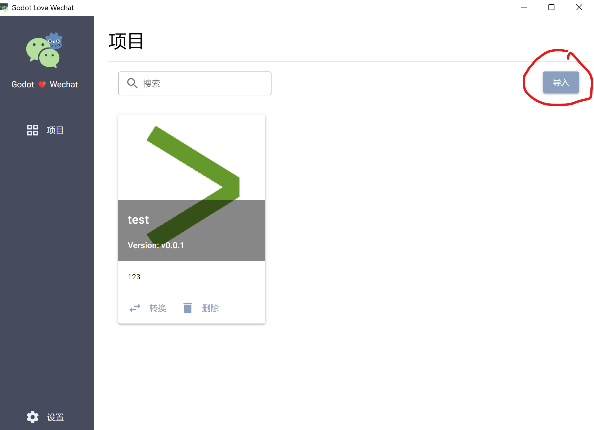
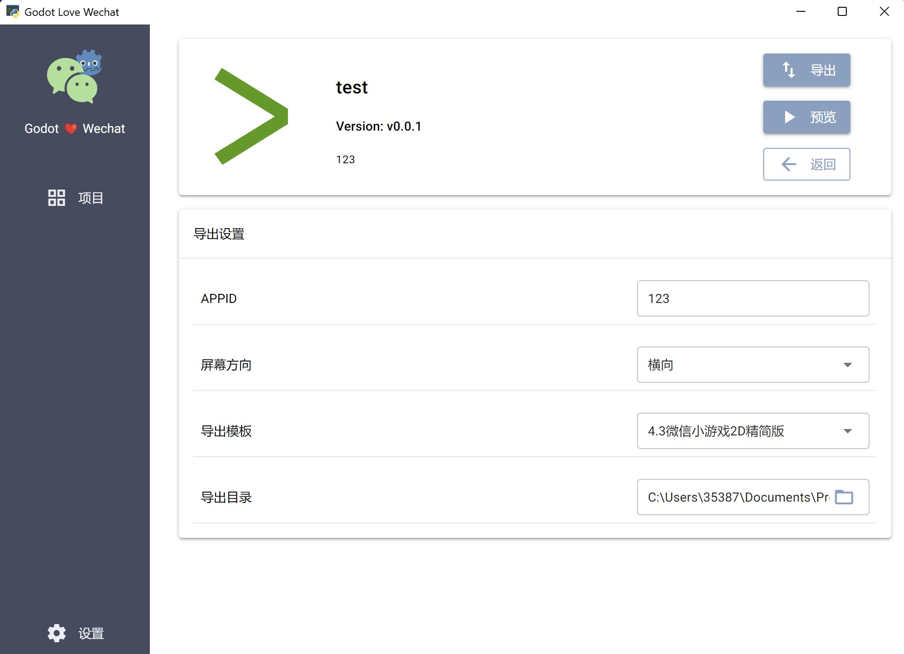
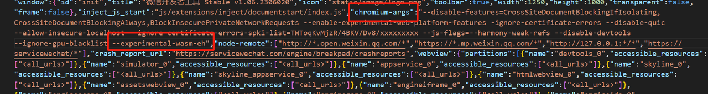
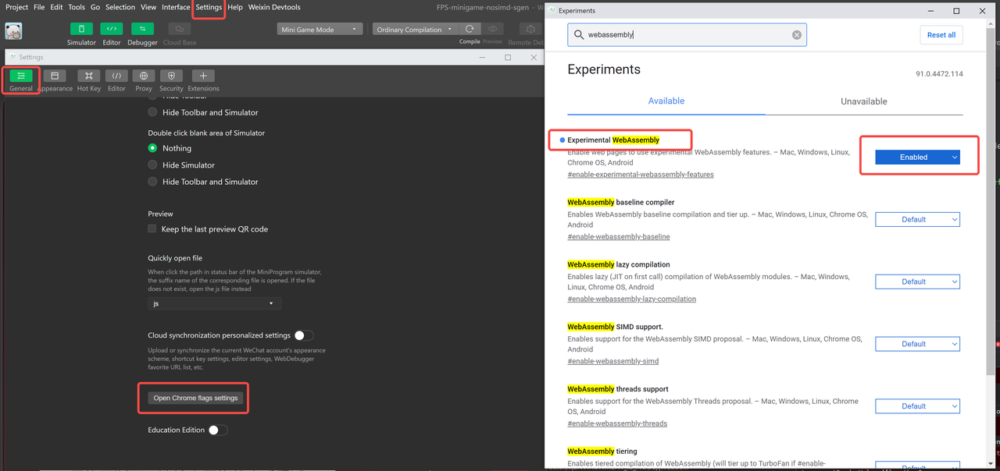
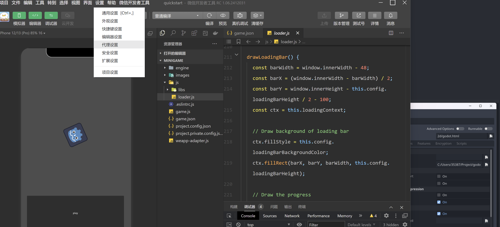
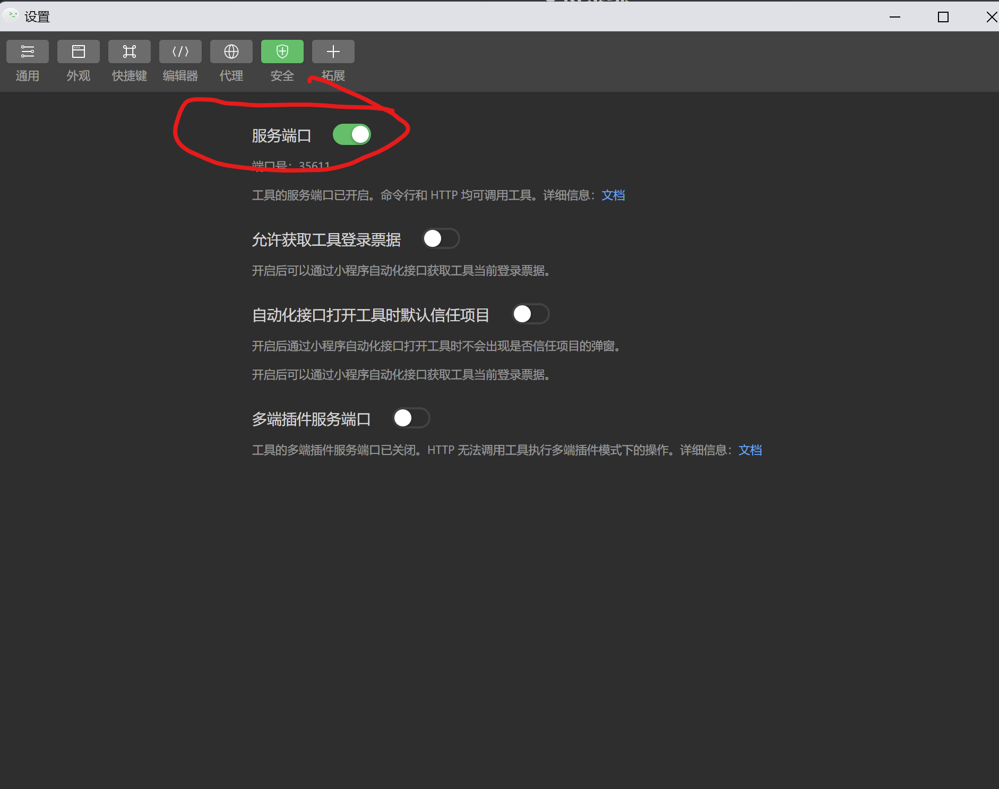
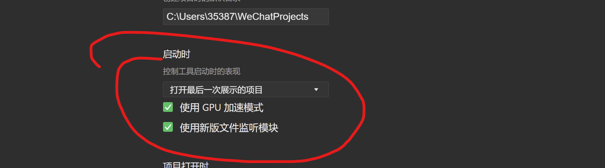
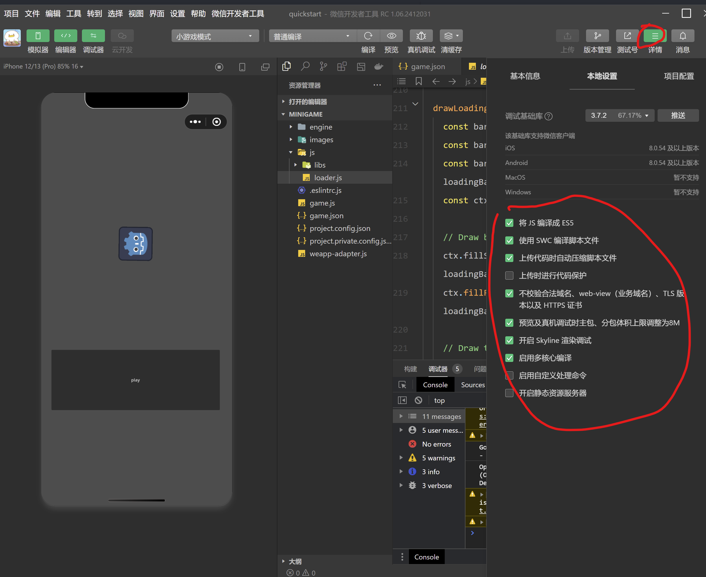

<div align="center">
  <h1>Godot小游戏转换工具</h1>
  </img>
</div>
<br/>

这是一个将Godot4.3 将WEB适配为微信小游戏的小工具，自行编译了Godot4.3的WASM，将ScriptProcessor的音频废案代码重新添加回来，使得在微信小游戏当中能够播放声音,并且受控于Godot的音频总线。
并且增加了将wasm的内存文件系统的用户文件夹定时拷贝至微信小游戏的文件系统

裁剪或关闭了以下模块：

- 高级文本服务
- 关闭了webrtc
- 关闭了webxr
- 关闭了Openxr
- 关闭了javascript_eval: 本来小游戏就不让eval

## RoadMap

- [x] 分离导出模板与打包的
- [x] 文件系统解决方案
- [ ] pck文件brotil压缩与加载
- [ ] 分包管理

## 支持系统

- Windows 11 因为用了webview2的依赖
- Macos (等待开发)

## 文件系统解决方案

wasm的文件系统方案，godot在web平台的方案是使用indexedb，然后将内存文件系统在合适时机同步到indexedb，小游戏环境并不存在这种东西。所以我的方案是定时将内存的文件系统定时同步到微信的文件系统。
然后在引擎启动后将微信的文件系统文件再同步到wasm的内存文件系统。所以这个方案有个缺点，如果你进行了存档等操作，可能要手动强制同步一下。这个api将在后面版本中提供

## 如何使用

### Godot编辑器设置

打开Godot的导出设置并添加Web导出


将你不需要被打包的文件夹或者文件进行过滤, 在Filters to exclude files里面


### 导出小工具设置

打开导出工具



设置godot引擎目录，和微信开发者工具的地址



打开项目列表导入你的项目



点击转换


单击导出即可

### 微信开发者工具设置

**重点！！！**，想要微信开发者工具预览小游戏你必须做以下设置

1. 打开开发者工具目录中的`code\package.nw\package.json`并进行编辑,并在chromium-args添加--experimental-wasm-eh标志，并重启电脑！
   
2. 打开实验性wasm设置，新版本应该都打开了
   

3. 导入导出的项目后在安全设置-安全设置中打开服务端口，这样你在导出工具里直接可以按预览按钮即可预览
   
   

4. 在设置/通用设置中确保打开GPU加速
   

5. 确保右边项目详情把这些都打开
   

## 常见问题

1. 打开报错

```
CompileError: WebAssembly.instantiate(): unexpected section (enable with --experimental-wasm-eh)
@+58331(env: Windows,mg,1.06.2409140; lib: 3.6.6)
```

参考上面的微信开发者工具设置，需要你修改下微信开发者工具，后面好像小游戏开发者工具自带

2. 打开报错类似这样

```
godot.js? [sm]:483 USER ERROR: Cannot get class 'SubViewportContainer'.
godot.js:6883 USER SCRIPT ERROR: Parse Error: Could not find base class "RichTextLabel".
```

精简版导出模板去除了高级gui，如果你项目使用了高级GUI,那么就会导致这样的错误，可以使用完整版模板导出，**注意，导出工具只有在第一次导出时会将整个模板导出，后续只会导出pck，所以如果发生这样的问题，请将导出目录下的所有文件删除，或者删除game.json**

3. 如何调用微信的api工具？

参考文档：https://docs.godotengine.org/en/stable/classes/class_javascriptbridge.html 使用godot的js bridge 来进行，也可以自己尝试封装一些sdk
目前来说，对于http请求，websocket这些都可以直接使用godot内置的工具，都进行了适配，如果不行就参考文档通过jsbridge进行封装
